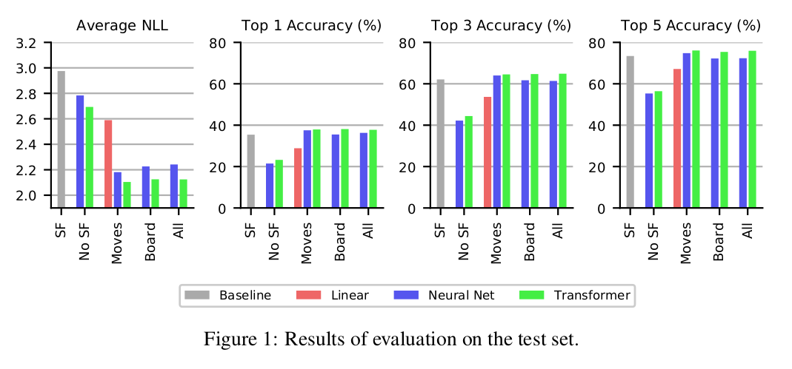

# Modelling-Human-Behaviour-in-Chess

## Project Brief:
In this project, we develop a predictive model that aims to play chess like a human. In other words, instead of treating chess as an optimization problem, we treat it as a supervised learning problem, using past data about people’s actions to predict their future moves. We take a novel approach to this problem: our model relies heavily on existing chess engines to evaluate possible moves, offloading the domain knowledge about which moves are “good” or “bad”. In a sense, our model does not need to learn how to play chess: it only needs to predict when humans will play these good or bad moves.

#### Chess dataset and Engine:
We use Lichess, the source for our dataset, and Stockfish, a strong chess engine as our source of domain-specific knowledge.

### Method :
Our dataset provides a unique challenge: each position has a different set of legal moves. Thus, predicting human moves is a multi-class classification problem, but with a different set of classes for each position. We dealt with this problem by creating separate features for each legal move and building models that accept a variable-length list of inputs. 
#### Features : 
For each legal move in a position, we compute three types of features: 

* *Move features*: which describeunique properties about each move, including Stockfish’s analysis of each move.
* *Board features*: which describe the current state of the game.
* *Evaluation features*: which contain Stockfish’s static evaluation of the position.

#### Models:
As is typical of multi-class classification problems, the goal of our models is to output a probability distribution over the legal moves. However, this modelling was complicated by the variable number of legal moves. We designed 3 model architectures that deal with this issue: LINEAR and NEURAL NET models that consider each move independently, and a TRANSFORMER model that is able to make comparisons between each of the legal moves.

### Results:
Compared to the STOCKFISH baseline, we found that the two models without Stockfish’s analysis features achieved better NLL, but had significant losses in accuracy. The three NEURAL NET models all achieved far lower NLL with comparable accuracy to
STOCKFISH , but with only minor differences between the three feature sets. Finally, the last three TRANSFORMER models had the lowest NLLs and highest accuracies, but with virtually no differences between the three models. Thus, while even simple models can fit the distribution of human play better than our baselines, it is clear that the transformer models’ ability to make comparisons between moves is a great advantage.

 

  

This project was developed through 4 milestones:
- **Milestone 1:** Project Proposal (Refer *Project_Proposal.pdf*)
- **Milestone 2:** Finding Relevant Papers for the project (Refer *Project_Reading_List.pdf*)
- **Milestone 3:** Summarising the papers listed in Milestone 2 (Refer *Literature_Survey.pdf*)
- **Milestone 4:** Final Project Report (Refer *Final_Report.pdf*)

Please refer project report for further details on method and results.

